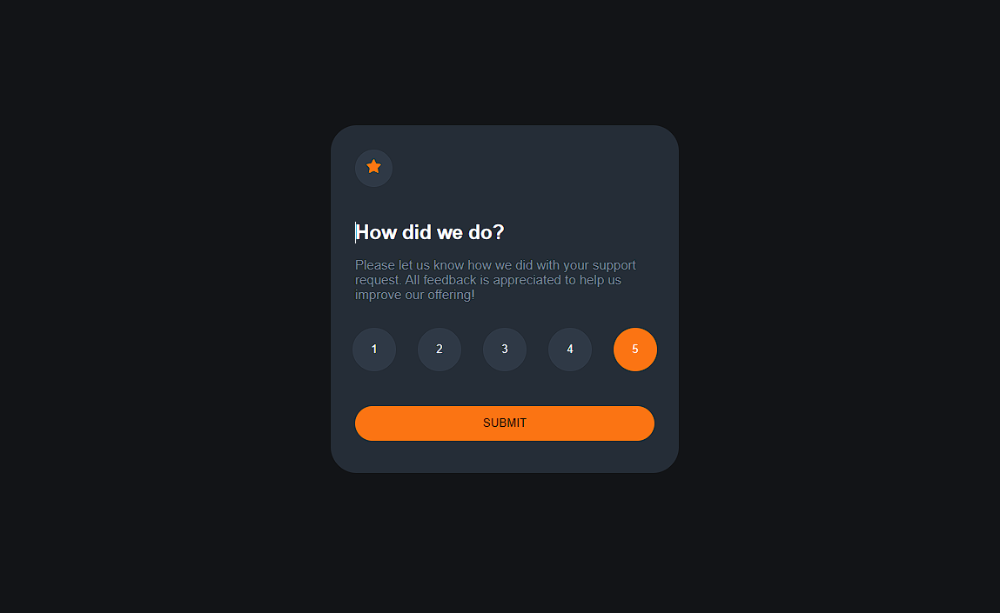
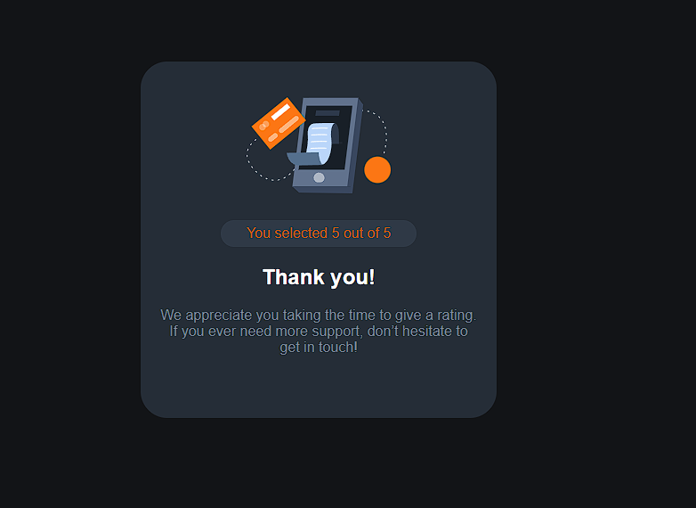

# Interactive rating component
___




**1. To run on a local machine, you need:**

**Install npm dependencies:**

```
npm install
```

**2. Run in development mode:**

```
npm run dev
```

*If everything went well, the project will be launched on http://localhost:5173/*